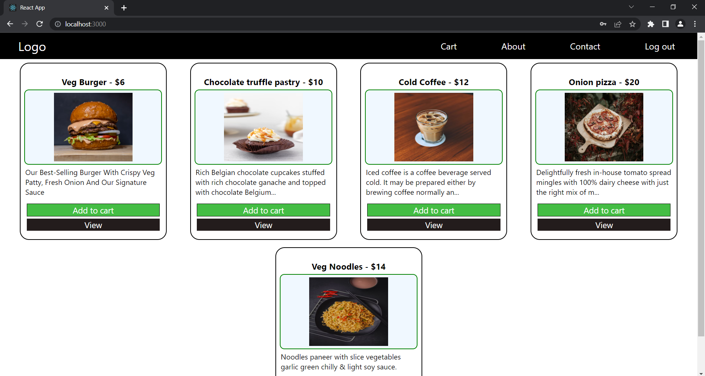
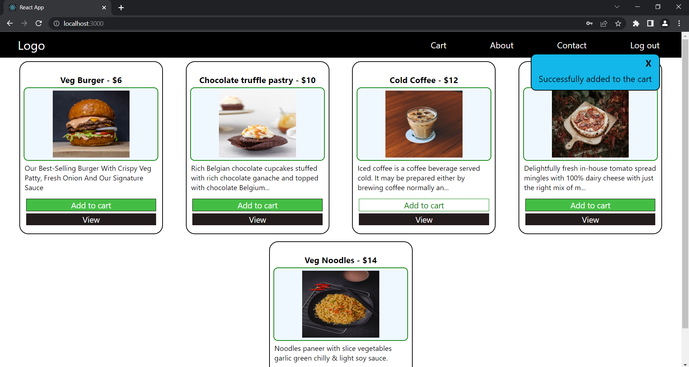

# MERN STACK FOOD ORDERING APP

## FEATURES OFFERED : 
* [x] ADMIN AUTH
* [x] USER AUTH
* [x] ADMIN SECTION
* [x] USER SECTION
* [x] USERS CAN ADD ITEMS TO CART
* [x] ADMIN CRUD FUNCTIONALITIES (FOR PRODUCTS ONLY)
* [x] RESPONSIVE
* [x] JWT AUTHENTICATION
* [x] COMPONENT RE-USE
* [x] OPTIMIZATION USING EVENT DELEGATION
* [x] ADD STYLE FROM ANY COMPONENT TO BASE COMPONENT.
* [x] TOAST COMPONENT
* [] OPTIMIZATION USING REACT HOOKS (useMemo(), useCallback()) 
* [] USERS CAN ORDER PRODUCTS
* [] USER PAYMENTS
* [] USER PROFILE SECTION
* [] USER PAYMENTS

# APP UI : 

1. LOG-IN UI

    -> ADMIN/ USER BOTH USE SAME LOGIN COMPONENT (TOKEN VERIFICATION AND SIGNING METHOD IS DIFFERENT).

    

    

1. USER-SIGNUP
    
    

    

1. ADMIN HOME 

    -> WEB DELEGATION FOR ADMIN NAV.
    
    -> ADMIN SECTION ALLOWS YOU TO CREATE, UPDATE, VIEW AND DELETE PRODUCTS.
    
    -> IN FUTURE IT WILL HAVE ACCESS TO ORDERS AND USERS.

    
    
    

1. USER HOMEPAGE

    -> UNACCESSIBLE FOR UNAUTHENTICATED USERS.

    

    

1. USER CART

    -> AUTH PROTECTED.

    
    
    

